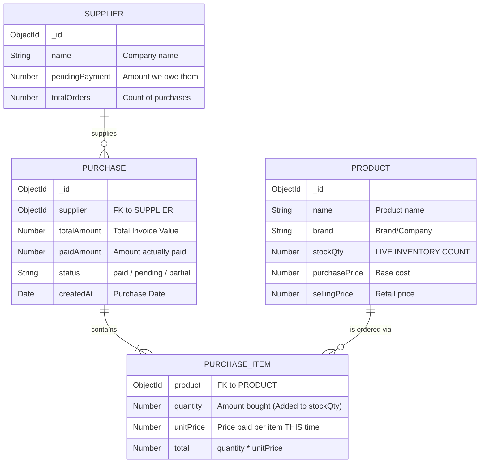

# POS System Architecture: Purchases, Inventory, Products, and Suppliers

This document maps how your core stock management entities are connected in the database.

## System Map (Entity Relationship)

## How They Connect & Interact

### 1. `SUPPLIER` (The Source)
Suppliers are independent entities. They exist whether you buy from them or not.
**Key Connection**: They connect to the rest of the system **only** through a `PURCHASE`. When a purchase is made, their `totalOrders` goes up, and if `paidAmount` < `totalAmount`, their `pendingPayment` goes up.

### 2. `PRODUCT` (The Subject)
Products are what you actually sell. The most important field here is `stockQty`.
**Key Connection**: `stockQty` is your **Live Inventory**. You do *not* manage stock by typing numbers manually (unless doing an adjustment). Stock goes up automatically when a `PURCHASE` happens, and down when a Sale happens.

### 3. `PURCHASE` (The Bridge)
This is the master transaction record. It links **ONE** Supplier to **MANY** Products.
If you buy 100 Maggi packets and 50 KitKats from Nestle India, that generates **ONE** Purchase document.

### 4. `PURCHASE_ITEM` (The Detail)
Because one Purchase can have many different items, the `items` array inside the Purchase holds the specifics.
**Crucial piece of data**: This array holds `unitPrice`. This represents what you paid for that specific product *on that specific date*.
**Why this matters**: This is how the **Price Comparison** tool works. By looking at all `PURCHASE_ITEM`s for "Maggi" across time, the system can see that Supplier A sold it for ₹11 last week, but Supplier B sold it for ₹12.50 today.

## The Data Flow (Real-World Example)

1. **User Action**: You click "Create Purchase Order" in the UI, selecting "Local Grocer" and adding "10x Amul Butter".
2. **Backend Engine (`purchaseController.js`)**:
   - It creates the `PURCHASE` record linking to "Local Grocer".
   - It loops through the items. It finds the "Amul Butter" `PRODUCT`.
   - **INVENTORY UPDATE**: It automatically executes `product.stockQty += 10`.
   - **FINANCE UPDATE**: The backend checks if you paid the full amount. If not, it executes `supplier.pendingPayment += remainingBalance`.

In summary, **Purchases** act as the central nervous system that automatically updates both your **Inventory (Products)** and your **Payables (Suppliers)** at the same time.
